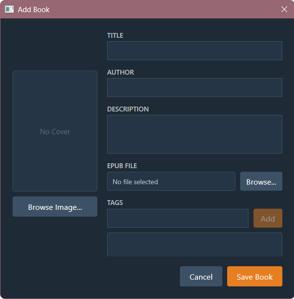
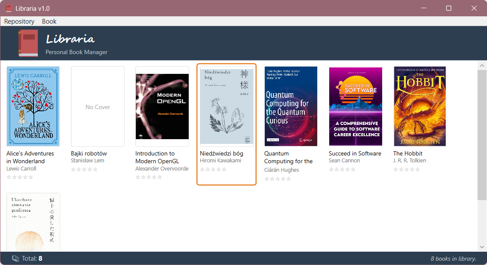

# Libraria – Aplikacja do Zarządzania Książkami

## Opis aplikacji

Przedmiotem zadania jest stworzenie aplikacji do zarządzania kolekcją elektronicznych książek oraz do wyświetlania ich zawartości z wybranego przez siebie formatu.

Aplikacja składa się z dwóch części:

1. **Lab:** Aplikacja bazowa do zarządzania książkami. W części laboratoryjnej należy stworzyć główny widok kolekcji książek oraz okno do dodawania nowych tytułów do listy.
2. **Home:** Dokończenie aplikacji laboratoryjnej — rozszerzenie aplikacji o nowe widoki oraz o okno czytnika książki. Część domowa aplikacji musi zostać wykonana w oparciu o zasady wzorca MVVM (Model – View – ViewModel).

### Zadanie laboratoryjne

Aplikacja powinna wyróżniać dwa kolory: kolor podstawowy i akcentowy. Oba kolory powinny być zdefiniowane w słowniku zasobów dostępnym dla całej aplikacji (również w innych oknach i widokach).
Oba kolory muszą być dostępne jako nazwane pędzle (`SolidColorBrush`) w `ResourceDictionary` scalonym z `App.xaml`.

---

### Layout głównego okna aplikacji (1p)

Wygląd okna aplikacji:
- Rozmiar szerokość × wysokość: **1000 × 650** (min. szerokość 920, min. wysokość 500)
- Tytuł aplikacji: **Libraria**
- Ikona książki widoczna na pasku tytułowym oraz pasku zadań
- Menu z dwoma opcjami — **Repository** i **Book**
  - Zakładka **Repository** w części labowej może pozostać pusta
  - Zakładka **Book** zawiera trzy opcje: **Add...**, **Edit...** oraz **Delete...**; opcja Edit nie będzie implementowana podczas laboratorium
- Górny pasek (wysokość 64 px) na tle koloru podstawowego zawierający:
  - Logo wczytane z załączonego pliku PNG
  - Nazwę aplikacji wyświetloną odręczną czcionką (np. „Segoe Script" lub podobną)
  - Podtytuł „Personal Book Manager" wyświetlony w szarym kolorze pod nazwą
- Główna część aplikacji — widok kolekcji książek
- Dolny pasek ze statystykami (wysokość 24 px)

---

### Dodawanie książek do kolekcji (3p)

Dodawanie książki odbywa się po naciśnięciu opcji **Book → Add...**. Po naciśnięciu pojawia się nowe okienko umożliwiające wpisanie podstawowych danych o książce:

- **Tytuł** – pole tekstowe
- **Imię i nazwisko autora** – pole tekstowe
- **Podgląd okładki** – prostokątny obszar (np. 120 × 160 px); gdy żadna okładka nie jest wybrana, wyświetla się napis „No Cover". Obrazek okładki nie może być rozciągnięty ani ścięty (użyj `UniformToFill`).
- Przycisk **Browse Image...** poniżej podglądu — otwiera okno dialogowe umożliwiające wybranie pliku PNG/JPG z okładką
- Przyciski **Save** i **Cancel** na dole okna
  - Przycisk **Save** powinien być ostylowany kolorem akcentowym i nieaktywny, gdy tytuł jest pusty

Widok okna (wymagane podczas laboratoriów są tylko wyżej wymienione elementy):

---

### Wyświetlanie książek w kolekcji (3p)

Książki w kolekcji wyświetlone są w głównej części okna:

- Każda książka wyświetlana jest jako kafelek zawierający:
  - Okładkę książki (obrazek)
  - Tytuł pod okładką (kolor domyślny)
  - Imię i nazwisko autora pod tytułem (kolor szary)
- Jeśli liczba kafelków w rzędzie przekroczy szerokość panelu, kolejne elementy pojawiają się w następnym rzędzie
- Po zapełnieniu dostępnego miejsca pojawia się pionowy scrollbar; gdy liczba rzędów nie wykracza poza rozmiary okna, scrollbar powinien być niewidoczny
- Powinna być możliwość zaznaczenia książki — po kliknięciu wokół kafelka pojawia się obwódka lub tło w kolorze akcentowym

---

### Usuwanie książek oraz wyświetlanie statystyk (1p)

**Usuwanie książek:**
- Gdy na liście zaznaczona jest książka, można ją usunąć za pomocą opcji **Book → Delete...** lub klawisza `Delete` na klawiaturze

**Wyświetlanie statystyk:**
- W dolnym pasku wyświetlana jest po lewej stronie **liczba książek** w kolekcji
- Po prawej stronie wyświetlany jest **ostatni komunikat statusu** (np. „Book added", „Book removed")
  - Wskazówka: statusy warto aktualizować po dodaniu lub usunięciu książki; nie ma ściśle wymaganych treści komunikatów

---

## Wskazówki

- `ResourceDictionary` oraz `ResourceDictionary.MergedDictionaries` — do globalnych kolorów i stylów
- `IValueConverter` oraz `BitmapImage` — konwerter zamieniający `byte[]` na źródło obrazu (`ImageSource`)
- `OpenFileDialog` — do otwierania okna wyboru pliku z okładką
- `ListBox` z `ItemsPanel` ustawionym na `WrapPanel` — do wyświetlania kafelków w rzędach
- `WrapPanel` — panel układający dzieci wierszami, zawijający do następnego rzędu po przekroczeniu szerokości
- `ScrollViewer` z `VerticalScrollBarVisibility="Auto"` — scrollbar widoczny tylko gdy potrzebny
- `ItemTemplate` i `DataTemplate` — do definiowania wyglądu pojedynczego kafelka książki
- `ItemContainerStyle` i `ControlTemplate.Triggers` — do obsługi zaznaczenia i podświetlenia przy hover
- `KeyBinding` / `InputBinding` — podpięcie klawisza `Delete` do komendy usunięcia książki
- `MenuItem` z `InputGestureText` — wyświetlanie skrótu klawiszowego w menu
- `IsEnabled` powiązany z walidacją pola tytułu — wyłączenie przycisku Save, gdy tytuł jest pusty
