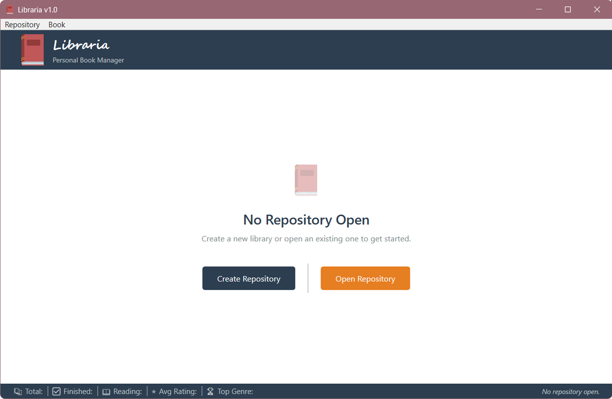
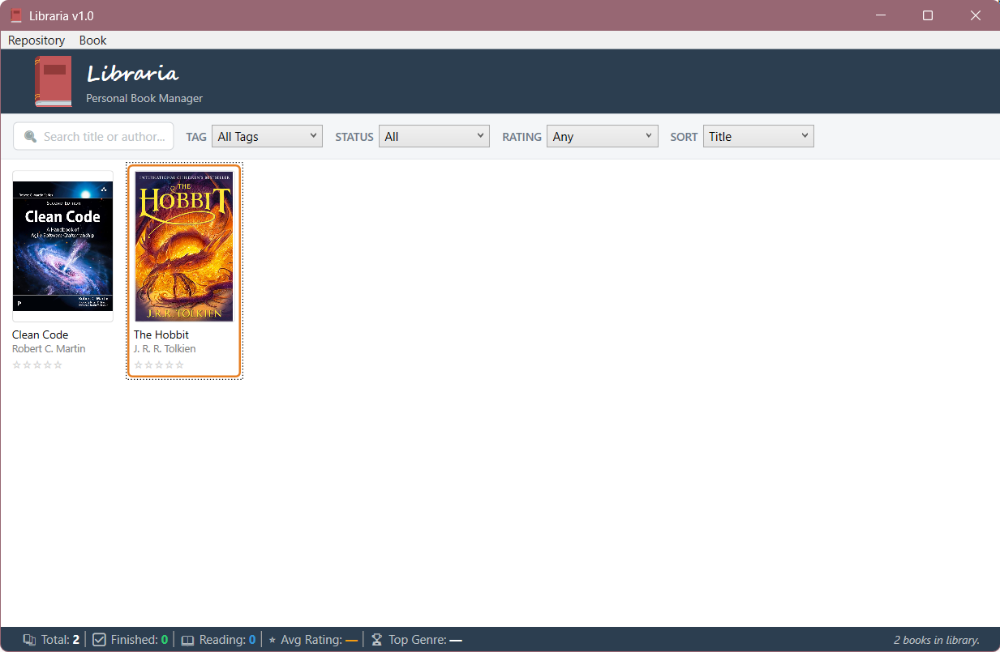
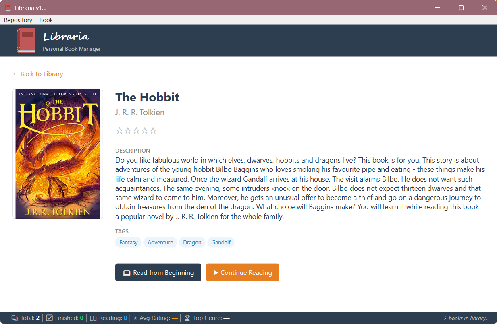
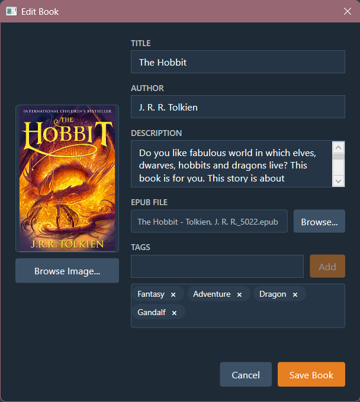
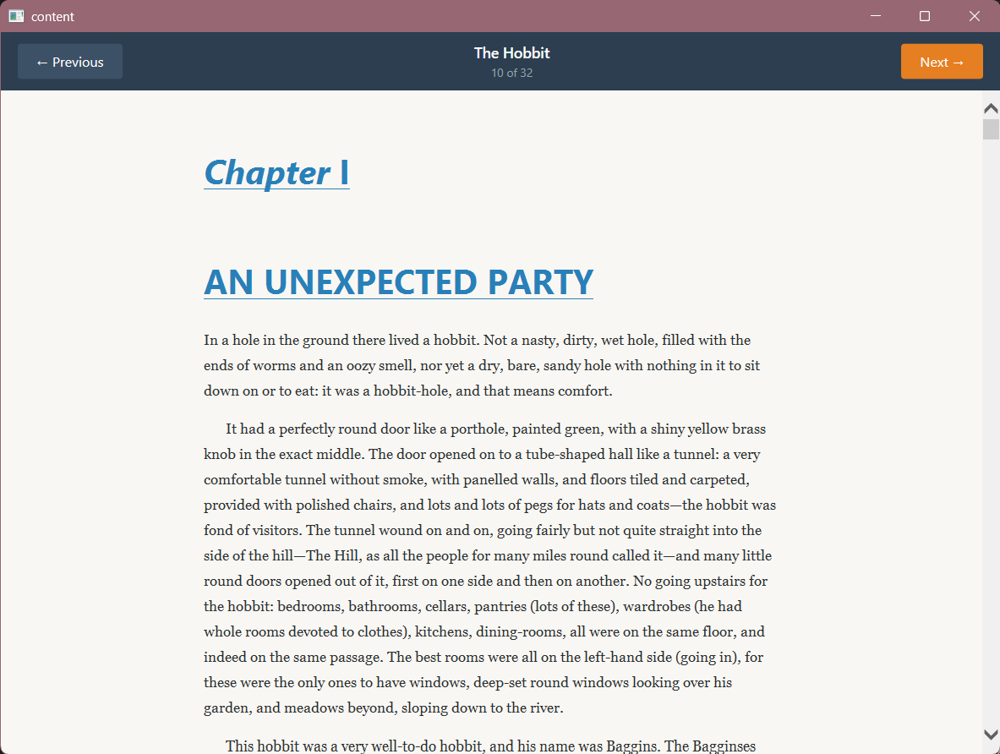

# Libraria – Część Domowa (12 punktów)

## Opis

Celem części domowej jest dokończenie i rozszerzenie aplikacji wykonanej podczas laboratorium. Aplikacja powinna zostać rozbudowana o zarządzanie repozytorium, nowe widoki oraz czytnik książek. Całość **musi** być zaimplementowana zgodnie ze wzorcem **MVVM (Model – View – ViewModel)**:

- Obsługa zdarzeń realizowana przez **komendy** (`ICommand` / `RelayCommand`), nie przez event handlery w code-behind.
- ViewModels przechowują stan i logikę; Views są pasywne i reagują tylko na wiązania danych.
- Powiązania (`Binding`) zamiast bezpośrednich odwołań do kontrolek w kodzie.

---

## Zadania

### 1. Infrastruktura MVVM — 1 punkt

Zaimplementuj bazowe klasy infrastruktury, z których będą korzystać wszystkie ViewModele:

#### BaseViewModel
Abstrakcyjna klasa bazowa implementująca `INotifyPropertyChanged`:
- Metoda `OnPropertyChanged(string? propertyName)` — wywołuje zdarzenie `PropertyChanged`; warto użyć atrybutu `[CallerMemberName]`, aby nie musieć podawać nazwy właściwości ręcznie.
- Metoda pomocnicza `SetProperty<T>(ref T field, T value, ...)` — ustawia pole, jeśli wartość uległa zmianie, i wywołuje `OnPropertyChanged`; dzięki niej każdy setter w ViewModelu może być jednolinijkowy.

#### RelayCommand
Implementacja `ICommand`:
- Konstruktor przyjmujący `Action execute` i opcjonalny `Func<bool> canExecute`.
- Drugi konstruktor (lub przeciążenie) przyjmujący `Action<object?> execute` i `Func<object?, bool>? canExecute` — do komend sparametryzowanych (np. usuwania konkretnego tagu).
- Zdarzenie `CanExecuteChanged` powinno być podpięte do `CommandManager.RequerySuggested`, aby WPF automatycznie odświeżał stan przycisków.
- Metoda `RaiseCanExecuteChanged()` do ręcznego wymuszenia odświeżenia.


---

### 2. Zarządzanie repozytorium — 1 punkt

Zaimplementuj zapis i odczyt kolekcji książek do/z pliku na dysk.

#### Format pliku repozytorium
Repozytorium jest zapisywane do pliku w wybranym przez studenta formacie (np. JSON, XML lub archiwum ZIP z plikiem metadanych o niestandardowym rozszerzeniu, np. `*.librepo`). Plik przechowuje listę wszystkich książek wraz z ich danymi, w tym okładkami (np. zakodowanymi w Base64 lub jako oddzielne pliki w archiwum).

#### Automatyczny zapis
Zapis do pliku powinien odbywać się automatycznie — każda zmiana w kolekcji (dodanie, edycja lub usunięcie książki) jest natychmiast odzwierciedlana w pliku repozytorium, bez konieczności ręcznego klikania „Zapisz".

#### Komendy menu Repository
Menu **Repository** zawiera opcje **Create** i **Open**:
- **Create** — pozwala wybrać lokalizację nowego pliku repozytorium i tworzy je jako puste.
- **Open** — otwiera okno dialogowe wyboru pliku i wczytuje istniejące repozytorium.

---

### 3. Widoki i nawigacja — 1 punkt

Zaimplementuj mechanizm przełączania między widokami w głównym oknie aplikacji.

#### Nawigacja przez MainViewModel
`MainViewModel` zarządza aktualnie wyświetlanym widokiem za pomocą właściwości `CurrentPage`. Przepływ nawigacji:

**WelcomeView** → (po otwarciu/utworzeniu repozytorium) **BookListView** ↔ (po kliknięciu kafelka) **BookDetailView**

**Welcome View:** 


**Book List View:** 


**Book Details View:** 


Widok **WelcomeView** wyświetlany jest przy starcie aplikacji, zanim użytkownik załaduje repozytorium. Zawiera dwa przyciski: **Utwórz nowe repozytorium** i **Otwórz istniejące repozytorium**, powiązane z komendami z zadania 2. Po wybraniu jednej z opcji aplikacja przechodzi do **BookListView**.

Widok **BookDetailView** wyświetlany jest zamiast listy w głównym oknie i zawiera:
- Okładkę, tytuł i autora — zawsze widoczne.
- Opis — widoczny tylko gdy nie jest pusty.
- Tagi — widoczne tylko gdy przypisano co najmniej jeden tag.
- Postęp czytania — widoczny tylko gdy liczba stron jest określona.
- Przycisk **Czytaj od początku** — widoczny tylko gdy do książki jest przypisany plik z treścią.
- Przycisk **Kontynuuj czytanie** — widoczny tylko gdy plik jest przypisany **oraz** poprzednia sesja zakończyła się na stronie/rozdziale większym niż pierwszy.
- Przycisk **Wstecz** — powrót do listy książek.

#### Przełączanie widoków przez DataTemplate
W `MainWindow.xaml` zdefiniuj `DataTemplate` dla każdego typu ViewModelu — `ContentControl` powiązany z `CurrentPage` automatycznie wybierze właściwy widok bez logiki w code-behind:
```xml
<DataTemplate DataType="{x:Type vm:WelcomeViewModel}">
    <views:WelcomeView />
</DataTemplate>
<DataTemplate DataType="{x:Type vm:BookListViewModel}">
    <views:BookListView />
</DataTemplate>
<!-- itd. -->
```

---

### 4. Edycja danych książki (BookEditViewModel) — 1 punkt

Przepisz logikę okna dodawania/edycji książki tak, żeby cały stan i działania były zarządzane przez `BookEditViewModel`, a code-behind okna był minimalny (jedynie `InitializeComponent` i podpięcie `DataContext`).

#### Uruchamianie okna edycji
Okno edycji powinno być dostępne z dwóch miejsc:
- **BookListView** — po zaznaczeniu książki na liście i wybraniu opcji **Book → Edit...** z menu (lub naciśnięciu odpowiedniego skrótu klawiszowego).
- **BookDetailView** — po naciśnięciu przycisku **Edytuj** widocznego w widoku szczegółów wybranej książki.

W obu przypadkach okno otwiera się wypełnione aktualnymi danymi wybranej książki, a po zatwierdzeniu zmiany są zapisywane do obiektu `Book` i automatycznie utrwalane w repozytorium.

#### Komendy BookEditViewModel

| Komenda | Działanie |
|---|---|
| `BrowseCoverCommand` | Otwiera okno dialogowe wyboru pliku graficznego (PNG/JPG) i wczytuje wybraną okładkę |
| `BrowseBookCommand` | Otwiera okno dialogowe wyboru pliku książki i ustawia ścieżkę |
| `AddTagCommand` | Dodaje wpisany tag do listy i czyści pole tekstowe |
| `RemoveTagCommand` | Usuwa wybrany tag z listy |
| `SaveCommand` | Zatwierdza formularz; niedostępna gdy pole **Title** jest puste |
| `CancelCommand` | Anuluje i zamyka okno bez zapisywania zmian |

ViewModel zamyka okno przez zdarzenie (np. `CloseRequested`), które code-behind subskrybuje — ViewModel nie odwołuje się do widoku bezpośrednio.



---

### 5. Kontrolki użytkownika — 2 punkty (po 1 punkcie za każdą)

Stwórz dwie wielokrotnego użytku kontrolki użytkownika (`UserControl`), możliwe do osadzenia w dowolnym widoku aplikacji.

#### RatingControl — 1 punkt
Kontrolka wyświetlająca ocenę w postaci gwiazdek:
- Wyświetla N gwiazdek (np. 5), wypełnionych lub pustych, odpowiadających aktualnej wartości oceny.
- Obsługuje dwa tryby: **tylko do odczytu** (np. na kafelku listy i w widoku szczegółów) i **edytowalny** (np. w oknie edycji — kliknięcie na gwiazdkę zmienia ocenę).
- W trybie edytowalnym najechanie kursorem na gwiazdkę podświetla ją i wszystkie poprzednie.
- Ekspozycja właściwości zależności (`DependencyProperty`): wartość oceny, tryb tylko do odczytu, rozmiar gwiazdek.

#### TagControl — 1 punkt
Kontrolka wyświetlająca listę tagów jako etykietki (chipy):
- Każdy tag wyświetlany jest jako zaokrąglona etykietka z tekstem.
- Obsługuje dwa tryby: **tylko do odczytu** (wyświetlanie tagów w widoku listy i szczegółów) i **edytowalny** (każdy chip zawiera przycisk „×" do usunięcia tagu, np. w oknie edycji).
- Etykietki zawijają się do nowego wiersza gdy przekroczą dostępną szerokość.
- Ekspozycja właściwości zależności (`DependencyProperty`): kolekcja tagów, tryb edytowalny, komenda usuwania tagu, kolory chipów.

---

### 6. Pasek statystyk — 1 punkt

Zaimplementuj dolny pasek okna głównego wyświetlający bieżące statystyki kolekcji oraz ostatni komunikat statusu.

#### Wyświetlane informacje
Pasek statystyk widoczny jest zawsze na dole okna i zawiera:
- **Liczbę wszystkich książek** w repozytorium.
- **Liczbę książek przeczytanych** i **w trakcie czytania**.
- **Średnią ocenę** kolekcji (np. „3,8 ★" lub „—" gdy żadna książka nie ma oceny).
- **Najpopularniejszy gatunek** (lub „—" gdy brak danych).
- **Ostatni komunikat statusu** (np. „Dodano książkę", „Usunięto książkę", „Repozytorium zapisane") wyświetlany po prawej stronie.

#### Wymagania
- Statystyki aktualizują się automatycznie po każdej zmianie kolekcji.
- Pasek jest zaimplementowany jako osobna kontrolka użytkownika (`StatisticsBarControl`) z właściwościami zależności lub powiązaniami z modelem statystyk.
- Komunikat statusu jest aktualizowany po każdej istotnej operacji (dodanie, edycja, usunięcie książki, wczytanie repozytorium).

---

### 7. Wyszukiwanie i filtrowanie kolekcji — 2 punkty

Rozbuduj `BookListViewModel` o mechanizm filtrowania i sortowania widocznej kolekcji.

#### Filtry i sortowanie
Pasek filtrów nad listą książek zawiera:
- Pole tekstowe **Search** — filtruje listę na bieżąco po tytule i autorze (bez rozróżniania wielkości liter).
- Lista rozwijana **Status** — pozwala ograniczyć widok do książek o wybranym statusie czytania (Wszystkie / Nieprzeczytane / W trakcie / Przeczytane).
- Lista rozwijana **Rating** — filtruje według minimalnej oceny.
- Lista rozwijana **Sort** — sortuje kolekcję według wybranego kryterium (np. tytuł, autor, ocena).
- Przycisk **Wyczyść filtry** — resetuje wszystkie filtry; widoczny tylko gdy co najmniej jeden filtr jest aktywny.

#### Kolekcja wynikowa
Lista książek wyświetlana w oknie odpowiada aktualnie aktywnym filtrom — zmiana dowolnego filtru natychmiast aktualizuje wyświetlaną kolekcję bez konieczności klikania „Zastosuj".

---

### 8. Czytnik książek — 3 punkty

Zaimplementuj okno czytnika umożliwiające przeglądanie treści przypisanej do książki. Student **sam wybiera obsługiwany format pliku** — do wyboru:

| Format | Uwagi |
|---|---|
| **Markdown (`.md`)** | Wczytaj plik tekstowy i wyrenderuj go jako sformatowany tekst (np. przez konwersję do HTML i osadzenie w `WebBrowser`, lub przez `FlowDocument` z podstawowym formatowaniem). |
| **EPUB (`.epub`)** | Format ZIP zawierający pliki HTML z treścią; wymagane parsowanie `container.xml` i `content.opf` w celu ustalenia kolejności rozdziałów. |
| **PDF (`.pdf`)** | Wyświetl plik przez osadzenie przeglądarki PDF (np. komponent `WebBrowser` z wtyczką systemową lub bibliotekę zewnętrzną, np. PdfiumViewer). |

Niezależnie od wybranego formatu, czytnik musi spełniać następujące wymagania:

#### Okno czytnika
- Wyświetla treść książki — tekst, obrazy i podstawowe formatowanie zgodnie z możliwościami wybranego formatu.
- Pasek nawigacji u góry zawiera:
  - Przycisk **Poprzedni** — niedostępny na pierwszej stronie/rozdziale.
  - Informację o aktualnym miejscu i łącznej liczbie stron/rozdziałów (np. „Rozdział 2 z 15").
  - Przycisk **Następny** — niedostępny na ostatniej stronie/rozdziale.
- Pozycja czytania jest **zapamiętywana** — po zamknięciu i ponownym otwarciu czytnik wznawia od miejsca, gdzie zakończono poprzednią sesję. Dzięki temu przycisk **Kontynuuj czytanie** w widoku szczegółów będzie dostępny.

#### ReaderViewModel
- Przechowuje aktualną pozycję czytania i aktualizuje ją przy każdej zmianie strony/rozdziału.
- Udostępnia właściwości decydujące o dostępności przycisków nawigacji.
- Pozycja jest zapisywana do obiektu `Book` i automatycznie utrwalana przez mechanizm zapisu repozytorium z zadania 2.

Reader View:


---

## Punktacja

| # | Zadanie | Punkty |
|---|---------|--------|
| 1 | Infrastruktura MVVM (`BaseViewModel`, `RelayCommand`) | 1 |
| 2 | Zarządzanie repozytorium (`WelcomeView`, format pliku, automatyczny zapis) | 1 |
| 3 | Widoki i nawigacja (`MainViewModel`, `BookDetailView`, DataTemplate) | 1 |
| 4 | Edycja danych książki (`BookEditViewModel`, uruchamianie z listy i widoku szczegółów) | 1 |
| 5 | Kontrolki użytkownika (`RatingControl`, `TagControl`) | 2 |
| 6 | Pasek statystyk (`StatisticsBarControl`) | 1 |
| 7 | Wyszukiwanie i filtrowanie kolekcji | 2 |
| 8 | Czytnik książek | 3 |
| **Razem** | | **12** |

---

## Uwagi końcowe

- **Brak MVVM = brak punktów** za daną funkcjonalność. Jeśli zadanie jest zrealizowane przez event handlery w code-behind zamiast przez komendy, nie przyznaje się punktów za tę część.
- **Kompilacja** — projekt musi się kompilować bez błędów. Niedziałająca funkcjonalność może skutkować utratą punktów za zależne od niej zadania.
- **Wybór formatu** — przy oddaniu zadania należy podać, który format pliku książki został wybrany i dlaczego.
