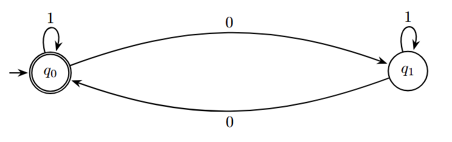

# Interaktywne środowisko do projektowania i symulacji deterministycznych automatów skończonych

Celem projektu jest symulacja działania automatu skończonego na zadanym słowie wejściowym z możliwością śledzenia przebiegu obliczeń.

## Definicja

Automatem skończonym deterministycznym (**DFA**, ang. _Deterministic Finite Automaton_) nazywamy strukturę

$$M = (Q, \Sigma, \delta, q_0, F)$$

gdzie:

- $Q$ - skończony zbiór stanów ($Q = \{q_0, q_1, ..., q_n\}$),
- $\Sigma$ - skończony alfabet wejściowy,
- $q_0$ - stan początkowy ($q_0 \in Q$),
- $F$ - zbiór stanów akceptujących,
- $\delta$ - funkcja przejścia ($\delta: Q \times \Sigma \to Q$).

Obliczenie DFA polega na wykonaniu kolejnych ruchów określonych wartościami funkcji przejścia $\delta$. Na podstawie symbolu $x$ czytanego przez głowicę taśmy oraz na podstawie stanu $p$, w którym jest sterowanie, następuje:

- przejście sterowania do pewnego stanu $q \in Q$,
- przesunięcie głowicy o jedną komórkę w prawo.

DFA będzie wykonywać kolejne ruchy aż do wczytania wszystkich symboli wejściowych. Wtedy nastąpi zatrzymanie obliczeń automatu. Automat zaakceptuje dane wejściowe wtedy i tylko wtedy, gdy automat zakończy obliczenia w stanie akceptującym (należącym do $F$).

**Uwaga:** Przyjmujemy, że jeżeli w danym stanie automat napotka literę alfabetu, dla której nie ma przejścia ($\delta$ nie jest funkcją całkowitą), automat odrzuca takie słowo. 

### Przykład

  

Rysunek przedstawia prosty automat akceptujący język $L$ nad alfabetem $\Sigma = {0, 1}$, składający się z ciągów binarnych o parzystej liczbie zer. Automat zaakceptuje słowo 100, natomiast odrzuci słowo 10100.

Więcej informacji teoretycznych można znaleźć w książce _"Automata Theory and Formal Languages"_, rozdział 7 _"Finite automata"_, Władysław Homenda, Witod Pedrycz lub w źródłach internetowych.

## Opis aplikacji

Aplikacja składa się z dwóch części:

1. **Lab:** Edytora automatów, który pozwala na tworzenie automatu oraz jego eksport/import z pliku.
2. **Home:** Środowiska uruchomieniowego, które umożliwia import automatu z pliku oraz symulację obliczeń na zadanym słowie wejściowym.

### Środowisko uruchomieniowe - zadanie projektowe

Należy rozszerzyć funkcjonalności opisane w części laboratoryjnej o następujące elementy:
- **Stan:** (2p)
  - Każdy stan posiada dodatkowe atrybuty w postaci:
    - koloru wypełnienia,
    - koloru krawędzi,
    - promienia,
    - grubości krawędzi.
  - UI pozwala modyfikować atrybuty dla aktywnego stanu poprzez _Data Binding_ oraz dedykowane kontrolki (_color picker_, _slider_, _input_ itp.).
- **Przejścia:** (1p)
  - Każde przejście posiada etykietę postaci: `a,b,c`, gdzie $a, b, c \in \Sigma$.
  - Podczas dodawania przejścia pomiędzy stanami istnieje możliwość określenia etykiety.
  - Każde przejście ma wyróżniony koniec (patrz [Przykład](#przykład)).
  - Jeżeli istnieją przejścia pomiędzy $q_i$ oraz $q_j$ w obie strony, to na płótnie przejścia te nie nakładają się na siebie.
  - Przejście może prowadzić do tego samego stanu (patrz [Przykład](#przykład)).
  - UI wyświetla aktualny alfabet, będący zbiorem unikalnych symboli wyodrębnionych ze wszystkich etykiet przejść.
- **Usuwanie przejścia:** (1p)
  - Istnieje możliwość aktywowania przejścia (w sposób analogiczny do aktywowania stanu).
  - Użytkownik ma możliwość usunięcia aktywnego przejścia.
- **Import z pliku:** (1p)
  - Użytkownik ma możliwość zaimportowania automatu z pliku w formacie JSON przy pomocy przycisku `Import` lub paska menu na górze ekranu aplikacji.
  - Format plików powinien być zgodny z przykładowym plikiem [automaton.json](./automaton.json).
  - Okno wyboru pliku powinno domyślnie otwierać się w folderze z przygotowanymi przykładowymi automatami.
  - Zawartość importowanego pliku powinna być walidowana. W przypadku niepoprawnych danych w pliku powinien zostać wyświetlony odpowiedni komunikat z błędem.
- **Eksport do pliku:** (1p)
  - Użytkownik ma możliwość wyeksportowania poprawnego automatu do pliku w formacie JSON, zgodnym z przykładowym plikiem [automaton.json](./automaton.json).
  - Użytkownik ma możliwość wyeksportowania automatu jako obrazek (format dowolny JPEG/PNG lub inny).

**Środowisko uruchomieniowe** powinno posiadać następujące funkcjonalności:
- **Wprowadzanie słowa wejściowego:** (1p)
  - Użytkownik ma możliwość wprowadzenia słowa wejściowego przed rozpoczęciem obliczeń.
  - Słowo wejściowe jest walidowane (powinno zawierać tylko litery z alfabetu $\Sigma$ dla aktualnie wczytanego automatu).
  - W trakcie obliczeń, aktualnie przetwarzana litera słowa jest wyróżniona.
  - W trakcie obliczeń nie ma możliwości edycji słowa wejściowego.
- **Tryb przejścia krokowego:** (2p)
  - Dostępne są przyciski `Next` oraz `Previous`, które powodują przejście/powrót sterowania do następnego/poprzedniego stanu $q \in Q$.
  - Przyciski powinny być zablokowane w zależności od aktualnie przetwarzanej litery słowa (na pierwszym słowie zablokowany jest przycisk `Previous`, a na ostatnim `Next`).
  - Stan, w którym aktualnie znajduje się sterowanie jest wyróżniony.
  - Aktywne przejście oraz symbol etykiety powinny zostać wyróżnione.
  - Po zakończeniu obliczeń użytkownik dostaje informację zwrotną, czy słowo zostało zaakceptowane, czy odrzucone.
- **Tryb animacji:** (2p)
  - Dostępne są przyciski `Start`, `Stop` oraz `Reset`, które powodują kolejno rozpoczęcie obliczeń, ich zatrzymanie oraz powrót do stanu początkowego (sterowanie wraca do stanu $q_0$, przetwarzana litera jest pierwszą w słowie).
  - Przyciski powinny być zablokowane w zależności od aktualnego stanu aplikacji (np. przed wczytaniem automatu wszystkie powinny być zablokowane, podczas trwania symulacji `Start` powinien być zablokowany itp.).
  - Szybkością animacji można sterować (slider).
- **Historia stanów:** (1p)
  - UI wyświetla w formie listy/tabeli historię obliczeń dla danego słowa (każdy element listy to para składająca się ze stanu i przetwarzanej litery).
  - Wczytanie nowego automatu lub zmiana słowa wejściowego powinna resetować stan listy.
  - Wciśnięcie przycisku `Next` powoduje dodanie elementu do listy/tabeli, natomiast wciśnięcie `Previous` powoduje usunięcie ostatniego elementu.

### Przykładowe inspiracje

Przykładowe istniejące aplikacje, którymi można się inspirować w celu lepszego zrozumienia polecenia/działania interfejsu użytkownika:
- [AutomataDraw](https://www.automadraw.com/fsm),
- [FSM Builder](https://fsm-builder.vercel.app/),
- [Automata Lab](https://www.automataaa.com).